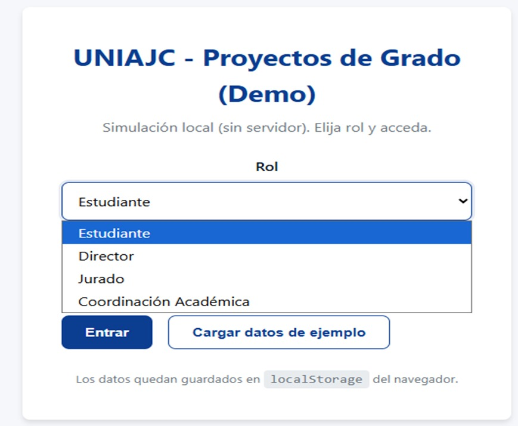
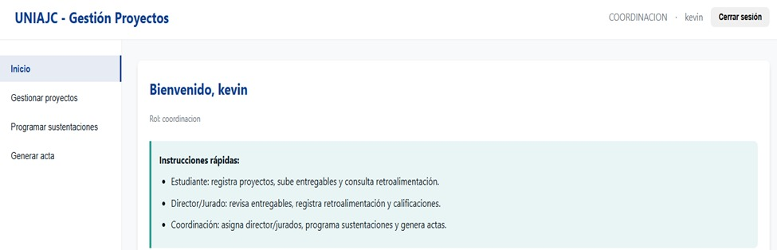
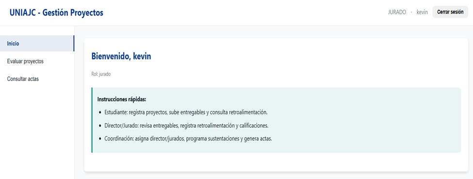
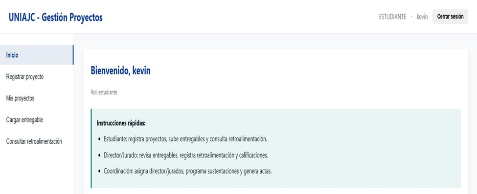
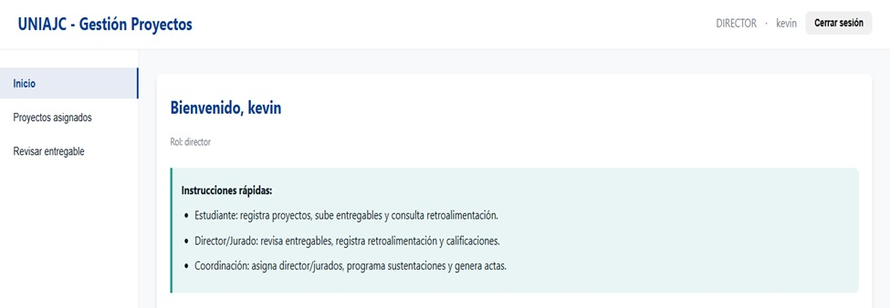

# Gestión de proyectos de grado y jurados en la UNIAJC

## 👥 Integrantes
- Geiner Alejandro Cordoba  
- Samuel Steven Combita
- Kevin David Corrales

## 📝 Descripción corta
**Gestión de proyectos de grado y jurados en la UNIAJC**: Es un proyecto el cual va a servir para que los estudiantes puedan subir sus proyectos de grados, se pueda asignar jurados y guardar todos los proyectos de forma segura.

## 📸 Captura de pantalla

## 📅 Fecha de entrega
20 de noviembre de 2025
